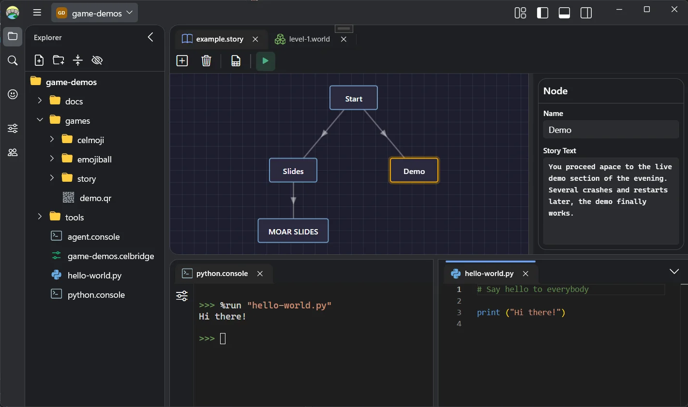

# Celbridge

<!-- Q: What is Celbridge, and why would I want it? -->

Build custom tools for your game dev team.

Tools are plain HTML files that live in your project. Your team opens the project in Celbridge and starts editing straight away. Celbridge is free and open source, and runs on Windows and macOS.

<!-- Q: What does it look like? -->



<!-- Q: Where do I get it, and how do I learn to use it? -->

Download Celbridge from [celbridge.org](https://celbridge.org/download/). The documentation is at [learn.celbridge.org](https://learn.celbridge.org/).

## Community

<!-- Q: Where do I get help, and how can I get involved? -->

Share what you build, ask questions and discuss feature ideas on the [community forum](https://celbridge.discourse.group/). Report bugs in [issues](https://github.com/celbridge-org/celbridge/issues). [CONTRIBUTING.md](CONTRIBUTING.md) explains the ways you can contribute.

<!-- Q: Is there anything else to discover? -->

*Mysterious note:* The first 🥚 is like the second. The second belongs to the third. The third is shorter than itself, and sits in the middle.

## Building from source

<!-- Q: Can I build Celbridge myself, and what do I need? -->

Celbridge is a C# application built with [.NET](https://dotnet.microsoft.com/) and [Uno Platform](https://platform.uno/). `global.json` pins the .NET SDK and Uno SDK versions. The first build downloads uv and a Python interpreter, so it needs an internet connection.

<!-- Q: Is anything missing from a build I make myself? -->

A build from source has no spreadsheet editor. The editor uses [MESCIUS SpreadJS](https://developer.mescius.com/spreadjs), which needs a commercial license.

### Windows

<!-- Q: How do I build it on Windows? -->

Celbridge supports Windows 11.

1. Install [Visual Studio 2026](https://visualstudio.microsoft.com/vs/). The free Community edition works.
2. Follow the [Uno Platform setup for Visual Studio](https://platform.uno/docs/articles/get-started-vs-2022.html).
3. Open `Celbridge.slnx`, and set `Celbridge.Application` as the startup project.
4. Choose `Celbridge (WinAppSDK Packaged)` from the debug target list, then build and run.

<!-- Q: What if the build fails? -->

If a build fails after pulling changes, rebuild the solution.

### macOS

<!-- Q: How do I build it on macOS? -->

1. Install the .NET 10 SDK.
2. Follow the [Uno Platform setup](https://platform.uno/docs/articles/get-started.html), whose `uno-check` tool installs the remaining prerequisites. Use [JetBrains Rider](https://platform.uno/docs/articles/get-started-rider.html) or [VS Code](https://platform.uno/docs/articles/get-started-vscode.html) as the IDE.
3. Build and run from the repository root:

   ```bash
   dotnet run --project Source/Celbridge/Celbridge.Application.csproj -f net10.0-desktop
   ```

## License

<!-- Q: Can I use, change and share Celbridge? -->

Celbridge is released under the [MIT License](LICENSE.txt). Every third-party component included in Celbridge is listed with its license and copyright notice in [THIRD-PARTY-LICENSES.txt](THIRD-PARTY-LICENSES.txt).

## Credits

<!-- Q: Who makes Celbridge? -->

Celbridge is made by a small team led by [Chris Gregan](https://github.com/chrisgregan). The [About page](https://celbridge.org/about/) introduces the team.

<!-- Q: Who else has helped? -->

Thank you to everyone who has contributed to Celbridge, especially [Katie Canning](https://katiewrites.games/), [Matt Smith](https://github.com/dr-matt-smith), [Matt Johnson](https://github.com/amazinggitboy) and [Ruth Shields](https://www.linkedin.com/in/ruth-shields-b0662788/).

<!-- Q: Who made the project possible? -->

This project was made possible by the Sabbatical Policy at [Romero Games](https://romerogames.com/). Huge thanks to Brenda Romero🏅 & John Romero and all of the incredible team at Romero Games for their support. ❤️❤️❤️

<!-- Q: Who sponsors Celbridge? -->

Many thanks to [MESCIUS SpreadJS](https://developer.mescius.com/spreadjs) for sponsoring Celbridge and supporting open source developers!

<!-- Q: What is Celbridge built on? -->

Celbridge is built on many fantastic open source projects, including:
- [.NET](https://dotnet.microsoft.com/)
- [Uno Platform](https://platform.uno/)
- [WebView2](https://developer.microsoft.com/microsoft-edge/webview2/)
- [Monaco Editor](https://microsoft.github.io/monaco-editor/)
- [xterm.js](https://xtermjs.org/)
- [Python](https://www.python.org/)
- [IPython](https://ipython.org/)
- [uv](https://docs.astral.sh/uv/)
- [ClosedXML](https://github.com/ClosedXML/ClosedXML)
- [marked](https://marked.js.org/)
- [highlight.js](https://highlightjs.org/)
- [Model Context Protocol C# SDK](https://github.com/modelcontextprotocol/csharp-sdk)
- [Nerd Fonts](https://www.nerdfonts.com/)
- [Bootstrap Icons](https://icons.getbootstrap.com/)
- [Cascadia Code](https://github.com/microsoft/cascadia-code)
